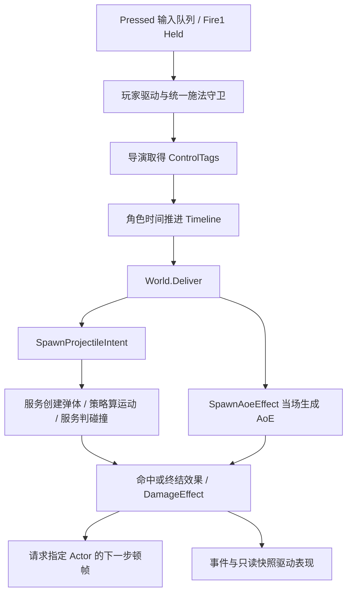
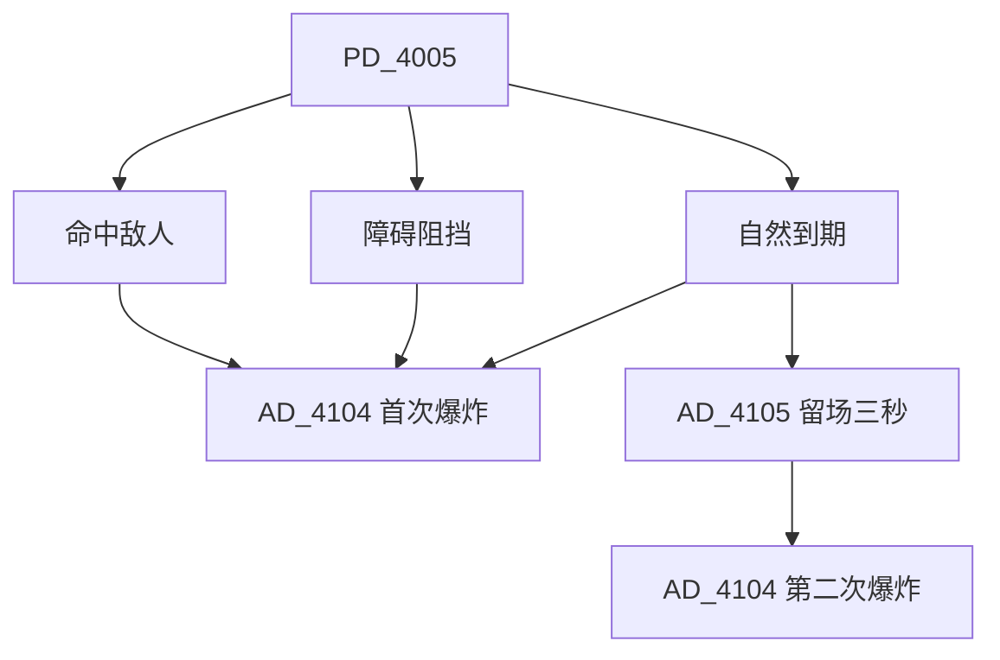

# 玩家技能实现详解（Buff Arena · Combat.Core）

> 2026-09-26：输入、控制标签、Actor 顿帧、重开和弹道策略统一迁移。本文描述当前实现；已删除单槽缓冲、Allow* 许可与活动运动开关的旧说明。

技能是“输入请求 → 技能节点 → 时间轴 → Clip/Payload → 效果 → 运行时实体”的组合。时间轴决定出手时机，弹体/AoE 管生命周期，DamageEffect 管伤害；表现层从快照和事件更新，不回写战斗状态。

## 1. 配置与执行边界

| 内容 | 作者数据 | 运行时责任 |
|---|---|---|
| 技能入口 | SK：InputToken、Timeline、AmmoCost、Fallback | BuffArenaPlayerComp 选技能/付费/传送分支 |
| 时间轴 | TL：Duration、ControlTags、Clips、Payloads | 每角色独立 TimelinePlayer、导演持有控制标签 |
| 弹体 | PD：运动参数、碰撞、终结效果袋 | ProjectileComp 实例状态与 ProjectileService |
| AoE | AD：半径、时长、占用差分、效果袋 | AoeComp 与 AoeService |
| 表现 | Cue、ViewBlueprintId | PresentHub、Animator、VFX/飘字池 |

BuffArenaDatabaseAsset.Bake 组装并校验目录；缺失资产/引用拒绝开局。烘焙结果只读共享，运行时计时、命中集合、队列和标签持有状态不能写回资产。角色死亡可以清理拥有的弹体/AoE；普通施法结束不销毁它们。



## 2. 三槽输入队列与连续普攻

InputBufferComp 持有最多三条 `{Token, 角色时间戳}`，默认有效期 0.8 秒。TryPeek/Consume 先清理过期项，Consume 只移除队首；新的跨帧输入在满队列时挤掉最旧项。同一技能两次真实按下是两条指令。

BuffArenaInputSource 使用 WasPressedThisFrame 采样 Pressed，Fire1 另读 IsPressed。Session 按 **Roll、Fire4、Monkey、Homing、Fire5、Fire3、Fire2、Fire1** 顺序提交同帧请求。容量只有三条，同帧超量先保留前三项，不让低优先级输入反向挤掉高优先级项。

所有 Pressed 都进入队列；PrimaryHeld 只是当前输入状态，不逐帧塞普攻。玩家驱动优先消费队列，队列为空且可施法才尝试 Held 普攻。松开立即停止自动重复。每个逻辑步至多尝试一次；未知令牌、缺弹、被阻挡的传送不会永久堵住队首。

施法、BlockSkill、受击、倒地只阻止消费，输入继续采样并按角色时间过期。死亡/回收/重开清空。局部顿帧期间角色时间不走，所以预输入不会因为冻结而失效。没有新增技能取消功能，Arena 等当前时间轴结束才播下一条。

## 3. 控制标签与持有生命周期

默认没有禁止标签就允许对应通道。TagComp.Acquire 返回 TagLease，Release 幂等且只释放自身贡献，旧句柄不能释放回收后新取得的标签。普通 Add/Remove 不会删除租约层。Buff 每个实例持有自己的句柄，刷新时不重复获取。

| 控制 Tag | 执行点/含义 |
|---|---|
| BlockMove | Motor 常规主动移动；不自动禁止技能位移或击退 |
| BlockRotate | 主动瞄准、摇杆转向、普通吸附 |
| BlockSkill | 导演、玩家驱动、AI、二次传送共用施法门槛 |
| BlockSkillMotion | 技能位移通道 |
| BlockHitMotion | 击退通道 |
| BlockGravity | 重力积分 |

时间轴 ControlTags 在资产中是 TagId 数值列表，烘焙为 TagId[]。旧 AllowMove/AllowRotate/AllowSkill 已删除，禁止项迁移为相应 Tag。翻滚持有 1011/1012；回旋镖持有 1013。

| 活动 | 持有标签或等效限制 |
|---|---|
| Root | BlockSkillMotion、BlockHitMotion |
| Attack | Casting、BlockHitMotion；其他限制由时间轴提供 |
| Hit | Stunned，派生 BlockMove/Rotate/Skill/SkillMotion |
| Knockdown | Downed，同上 |
| Dead | Dead，派生全部六项 |

Stunned、Downed、Dead、Silence 的控制含义在 TagComp 中统一解析，直接效果和 Buff 授予状态也生效。Silence 只派生 BlockSkill。活动 Enter 获取、Exit 释放；刷新受击只更新时间。导演的正常结束、Stop、替换、打断、Detach 均释放自己的时间轴句柄。

活动状态机继续负责打断、死亡通知和转换；删去 UseSkill/UseHit/ApplyGravity、FacingMode.Lock 和 MotorScale=0 这套并行布尔门槛。转向算法、转速、Steer/空中系数仍是数值策略。起手吸附通过 Motor.SnapForCast，在取得本技能标签前处理，但已有外部 BlockRotate 时不能越权。

## 4. 角色局部顿帧与固定帧序

Actor.Time 是角色时钟，提供 Time、Delta、IsStopped、RequestHitstop，不是可被跳过的普通 Tick 组件。世界每步开始先对所有当前角色锁定时钟状态，再推进组件。一次结算内申请的顿帧从下一世界逻辑步生效；重复请求取最大剩余帧，不叠加。

```text
世界：墙钟 → 显式世界顿帧检查 → 世界逻辑时间
  1 Actor.Time.BeginStep → 非冻结 Actor.TickAll
  2 非冻结 Actor：常规/技能位移
  3 独立弹体移动碰撞 → 非冻结攻击者 Hitbox
  4 ApplyEffectsIntent → Deliver（伤害、标签和死亡不因目标冻结而跳过）
  5 非冻结导演 FlushTimeline
  6 AoE：移动、吸弹、占用差分、脉冲、到期
  7 非冻结角色 Buff 周期/到期
  8 非冻结角色：击退/重力
  9 延迟回收
```

角色冻结：时间轴、活动恢复、无敌时间、Buff、技能冷却、输入过期、位移都暂停；已有 Hitbox 不主动发起查询。角色仍接受外部伤害、标签和死亡。外部击退保留到恢复，死亡清理待执行运动。独立子弹/AoE 不继承拥有者顿帧，世界刷怪照常推进。

DamageEffect/Asset 的 SourceHitstopFrames 与 TargetHitstopFrames 分别指定攻守顿帧。有效伤害或护盾吸收才触发；无伤害/无敌不触发。EvHitstop 携带双方帧数。普通 Damage 不调用世界 RequestHitstop；后者作为显式整场暂停能力保留，世界暂停时局部倒计时也不消耗。

AnimationPresent、GunnerAnimationPresent、PoseFollowPresent、HUD、相机按所属 Actor 读取冻结状态；冻结时姿态固定到逻辑位置，恢复后重新插值。VFX、飘字、UI 不随 Actor 冻结。死亡后 Arena 自身停止逻辑的现有规则保留，F5 不受其影响。

## 5. 弹道策略与重开

ProjectileComp.Setup 一次解析 IProjectileMotion，共享无状态实现：Linear、Accelerating、Returning、Bouncing。ImmediateHoming 与 Linear 共用直线运动，追踪交给 ProjectileSteering。

Evaluate 输入是定义、位置、朝向、Age/NextAge、地面高度、dt、可选拥有者位置，输出期望位置、速度、朝向、Touchdown。策略不生成、不碰撞、不扣血、不发事件；ProjectileService 保留碰撞、命中次数/冷却、寿命、拥有者回收、三种终结效果。单颗弹体状态不能放进策略共享实例。

```text
DrainSpawns → Steering（获取/旋转目标）→ Motion.Evaluate
    → Movement.Resolve → 寿命/回身碰撞/敌人碰撞 → 效果 → 回收
```

轨迹公式和终结顺序保持原样：加速 2t/(t+pivot)，回旋正弦去程/朝拥有者回程，弹跳分段抛物线并跨帧检测落地。没有引入通用轨迹编辑器或任意组合系统。

**F5：随时重新开局。** System/Restart 独立于 Gameplay，Bootstrap.Update 首先处理。RestartRun 有重复请求闸门，恢复 timeScale=1，Dispose 输入与会话，再异步重载当前 Arena 场景。保持配置种子；重新 Bake、建图、装配 World/Hub、生成玩家。输入资产运行时克隆，销毁时 Disable/Destroy，避免重复订阅。存活、死亡、世界或角色顿帧都能触发，不新加按钮。

## 6. 全部技能的逐项实现

范围是当前 Arena 内容库的 11 个技能节点：8 个玩家输入技能、自动换弹、敌人射击及传送标识节点。其他 Demo 的演示技能不属于这一局的技能表。以下按“输入 → 技能资产 → 时间轴 → 运行时实体 → 结束/命中分支”展开；最终验证状态见文末。

数字键3是 `Fire3/SK_2007`，`SK_2003` 则是 E 键猴子球。以下用按键和名称区分，不把节点编号当作操作顺序。

| 输入 | 技能 → 时间轴 → 实体 | 耗弹 |
|---|---|---:|
| 1 / 左键 | 2001 → 3001 → 4001 | 1 |
| 2 / 右键 | 2005 → 3005 → 4003 | 0 |
| 3 / 中键 | 2007 → 3007 → 4005 → 4104/4105 | 0 |
| 4 / 后退侧键 | 2006 → 3006 → 4004；再次按下请求传送 | 0 |
| 5 / 前进侧键 | 2008 → 3008 → buff_barrel | 0 |
| Q | 2004 → 3004 → 4006 | 2 |
| E | 2003 → 3003 → 4102 | 3 |
| Space | 2002 → 3002 → 无敌/位移 Clip | 0 |
| Fire1 缺弹 | 2009 → 3009 → RefillAmmo | 0 |
| 敌人行为树 | 2010 → 3010 → 4002 | 不走玩家扣弹 |
| 传送标识 | 2011 → 3006（当前不播放） | 0 |

共同执行链与源码入口：[输入采样](../Assets/Scripts/Combat/Unity/Game/BuffArenaInputSource.cs) → [Session 入队](../Assets/Scripts/Combat/Unity/Game/BuffArenaSession.cs) → [BuffArenaPlayerComp](../Assets/Scripts/Combat/Core/BuffArenaGameplay.cs) → [SkillDirectorComp](../Assets/Scripts/Combat/Core/CombatComps.cs) → [TimelinePlayer](../Assets/Scripts/Combat/Core/Timeline.cs) → [Effect](../Assets/Scripts/Combat/Core/Effects.cs) / [ProjectileService、AoeService](../Assets/Scripts/Combat/Core/RuntimeBodies.cs)。

按键优先级为 Roll、Fire4、Monkey、Homing、Fire5、Fire3、Fire2、Fire1。同一采样帧超过三次按下时保留最高优先级三条；不同采样帧按 FIFO，满队列淘汰最旧项。仅 Fire1 的 Held 会在空队列且可施法时连续射击，其他入口每次按下只入队一次。

角色受控或导演正在播放时等待，不清队列。缺弹等不可执行操作消费一次后结束本步尝试。只有 Fire1 缺弹回退到换弹；Q/E 缺弹没有回退。导演、AI 和 Fire4 二次传送共用 BlockSkill 门槛。

除翻滚、换弹外，当前时间轴都长 0.5 秒，在 0.1 秒执行 Payload；全部不随 ActionSpeed 缩放。实体生命周期与动作独立，动作结束不销毁已经发射的弹体。时间均为逻辑时间，顿帧暂停模拟，玩家死亡后 Arena 会话也会停止逻辑推进。

#### 数字键1：基础射击（`SK_2001 → TL_3001 → PD_4001`）

`LMB/1` 写入 `Fire1`。技能消耗 1 发弹药；弹药不足时不播放 `TL_3001`，而是读取 `FallbackSkill=2009`，播放换弹时间轴。时间轴在约 0.1 秒的 Payload 中生成 `PD_4001`，弹体沿施法朝向飞行，速度 6、寿命 10 秒、半径 0.1，命中数上限为 1。

`PD_4001.OnHit` 进入统一效果结算：伤害系数为 1，可暴击，并发布受击反馈和命中 Cue。弹体命中一次后立即耗尽；无敌目标不会消耗命中次数。攻击力在发射时快照，之后由 `World.Deliver` 统一处理防御、暴击、护盾和受击过滤。

资产：[SK_2001](../Assets/Combat/Config/Generated/Content/Skills/SK_2001.asset)、[TL_3001](../Assets/Combat/Config/Generated/Content/Timelines/TL_3001.asset)、[PD_4001](../Assets/Combat/Config/Generated/Content/Projectiles/PD_4001.asset)。

发射时同时发布 Muzzle Cue4201。弹体在发射点前方 0.4 出生，意图保存的是出弹时的角色位置/朝向，不是按键按下时的鼠标位置；生成服务创建后会在本帧继续移动。伤害暴击率为 5%，倍率 1.8，目标 Body 上的命中 Cue 为 4204。`SameTargetDelay=0.1` 不会让这一颗单次命中弹持续伤害。

基础伤害为 `max(0, SnapshotAtk × Coeff + Flat - Def)`，之后再乘暴击和双方伤害倍率、执行目标过滤和护盾吸收。固定的是攻击力快照，防御和全部倍率并未一起冻结。调整出弹前摇改 TL.Payload.Time；调整动作节奏改 TL.Duration；耗弹改 SK；速度/寿命与命中效果改 PD。

#### Space：翻滚（`SK_2002 → TL_3002`）

`Space` 对应输入 Action Jump，但采样映射到 RollHeld，再写入 `Roll`；Arena 中这里没有执行普通跳跃。它不生成弹体或伤害 Payload，`TL_3002` 持续 0.9 秒，包含无敌和位移 Clip，以及表现 Payload。技能位移提交给 Locomotion，在命中检测前积分；无敌标签由 Clip 生命周期维护。

资产：[SK_2002](../Assets/Combat/Config/Generated/Content/Skills/SK_2002.asset)、[TL_3002](../Assets/Combat/Config/Generated/Content/Timelines/TL_3002.asset)。

```text
时间       0       0.1      0.2                 0.8     0.9
Cue4203    开循环 -------------------------------停
IFrame             [---------------------------]
Move                        [本地前方总位移 2---]
Cue4208                                          触发
动作结束                                                  是
```

动画 Roll，无敌仅覆盖 0.1～0.8 秒。MoveZ=2 是 0.2～0.8 秒整段总位移，不是速度；MoveClipHandler 打开时把本地方向转换为世界方向，每步提交 `总位移×ActiveDelta/0.6`，所以没有阻挡和打断时总计移动 2 个单位。时间轴持有 BlockMove、BlockRotate，禁止常规操控，技能位移仍有效。

翻滚不持有 BlockSkill，但玩家驱动仍等到时间轴结束才消费有效输入。t=0 开启 InstanceKey=roll_fire 的循环 Cue4203，t=0.8 停止并发 Cue4208。逻辑 Clip 关闭/打断会撤销标签和位移控制状态；循环表现资源与逻辑 Clip 是不同的清理职责。

#### 数字键3：炸弹（`SK_2007 → TL_3007 → PD_4005`）

`3/中键` 写入 `Fire3`。`TL_3007` 持续 0.5 秒，在 0.1 秒生成 `PD_4005`。弹体速度 3、寿命 2 秒、弹跳高度 1，并在 1、1.6667、1.999 秒跨越三个落地点。它命中一次即销毁，撞到阻挡物也销毁。

命中敌人或撞障碍时只生成一次 `AD_4104` 爆炸；自然存活到 2 秒时，同时生成 `AD_4104` 和 `AD_4105`。`AD_4104` 半径 1.5，出生时立即脉冲，伤害系数 0.1，并发布爆炸 Cue；`AD_4105` 是半径 0.1、持续 3 秒的静态留场实体，到期后再次生成 `AD_4104`。留场阶段没有持续伤害，因此技能3的第二次伤害只发生在留场结束时。

资产：[SK_2007](../Assets/Combat/Config/Generated/Content/Skills/SK_2007.asset)、[TL_3007](../Assets/Combat/Config/Generated/Content/Timelines/TL_3007.asset)、[PD_4005](../Assets/Combat/Config/Generated/Content/Projectiles/PD_4005.asset)、[AD_4104](../Assets/Combat/Config/Generated/Content/Aoes/AD_4104.asset)、[AD_4105](../Assets/Combat/Config/Generated/Content/Aoes/AD_4105.asset)。

高度由 BounceHeightAt 按时间计算，不依赖 Rigidbody。每一段归一化进度为 u，`peak=BounceHeight×(本段时长/首段时长)^2`，`height=4×peak×u×(1-u)`；三段峰值约 1、0.444、0.110。落地采用 `previousAge < touchdown <= nextAge` 检查，跨帧仍能识别；跨点当帧把高度设回 GroundY，使用 flying=false 求解碰撞。落地本身不自动产生爆炸。



OnHit 耗尽直接停用和回收，不补跑 OnExpire。命中时爆炸点是 ApplyEffectsIntent 携带的受击者位置；撞墙分支在新位置写回前执行，使用弹体已保存的位置；自然到期使用到期位置。自然到期是弹体依次生成 4104、4105，并非首次爆炸到期后再生成留场实体。

4104 的 PulseOnSpawn=true 在创建时立即结算，正常固定步长下不会活到 0.45 秒的下一次脉冲。伤害系数 0.1、5% 暴击率、倍率 1.8，附带 HurtFeedback 和 Cue4204，到期发位置 Cue4206。4105 的 OnPulse/OnEnter/OnStay 全空，没有持续灼烧或接近引爆，视图为 buff_aoe_stayingbomb_view。第二次爆炸复用 4104，之后不再生成 4105，链条结束。

无提前命中/阻挡时，相对施法开始约 0.1 秒出弹、2.1 秒首爆并留场、5.1 秒二爆。实际以逻辑帧跨点为准。生成效果填写了 RadiusOverride/DurationOverride，单改 AoE 默认值可能无效；若希望命中和撞墙也留场，需要修改对应效果袋。

#### Q：追踪弹（`SK_2004 → TL_3004 → PD_4006`）

`Q` 写入 `Homing`，消耗 2 发弹药，缺弹无回退。时间轴在 0.1 秒生成 `PD_4006` 并发 Muzzle Cue4201。弹体速度 3、半径 0.1、寿命 100 秒，第一次有效命中后结束。搜索半径为 14，HomingRate=36000，HomingMaxTurn=0 表示没有额外单步转角限制；常用步长下可以一帧转向目标，不能认为其完全不受 dt 影响。

追踪目标失效时，是否重新锁定由 `HomingRetarget` 决定；当前资产关闭自动换目标，因此会保持最后航向。命中效果是一次性伤害，命中后由 `MaxHits=1` 结束。它不登记 `ProjectileTrackerComp`，所以不会触发传送逻辑。

资产：[SK_2004](../Assets/Combat/Config/Generated/Content/Skills/SK_2004.asset)、[TL_3004](../Assets/Combat/Config/Generated/Content/Timelines/TL_3004.asset)、[PD_4006](../Assets/Combat/Config/Generated/Content/Projectiles/PD_4006.asset)。

发射可以携带已有目标；初始目标 ID 无效时，SteerHoming 查询圆形范围并按水平距离平方选择最近敌人。初始没有目标可以继续获取；已经锁定过的目标失效且 HomingRetarget=false 时保持航向，不换人。伤害系数 1、5% 暴击、1.8 倍，附带受击反馈与 Cue4204。100 秒仅是寿命上限，碰撞可以提前结束。

#### 数字键2：回旋镖（`SK_2005 → TL_3005 → PD_4003`）

`2/RMB` 写入 `Fire2`，不耗弹。时间轴在 0.1 秒发布 Head Cue4202 并生成 `PD_4003`，时间轴在 0.5 秒内持有 BlockSkill，期间保留未过期队列；结束后释放，是否收回弹体不参与解锁判断。

弹体采用 ReturnToOwner，半径 0.5、寿命 10 秒、速度参数 5，MotionParam=1 指定 1 秒后回程。去程速度倍率为 `sin(t/1×PI)+0.1`；回程转向拥有者当前位置，倍率为 `sin(min((t-1)/1×PI,0.5))+0.1`。上限代码确实是 **0.5 弧度**，不是 PI/2。

MaxHits=99999 允许穿过多个目标，SameTargetDelay=0.5 允许同一个目标冷却后再次受击。每次伤害系数 1，暴击率 5%，倍率 1.8，并带受击反馈/Cue4204。RemoveOnObstacle=false 表示不因阻挡直接销毁，不代表绕过所有移动约束、保证穿墙。

回程时水平距离小于“弹半径 + 角色半径”则执行 OnOwnerHit 的 **Cue4202**，停用并请求回收；没有对拥有者的伤害。拥有者失效会失去回程方向计算条件，寿命上限仍可结束实体。

资产：[SK_2005](../Assets/Combat/Config/Generated/Content/Skills/SK_2005.asset)、[TL_3005](../Assets/Combat/Config/Generated/Content/Timelines/TL_3005.asset)、[PD_4003](../Assets/Combat/Config/Generated/Content/Projectiles/PD_4003.asset)。

#### 数字键4：传送弹（`SK_2006 → TL_3006 → PD_4004`）

`4/侧键` 使用 Pressed，与其他非普攻技能一样，按住不重复提交。第一次施放生成 `PD_4004`，速度 6、寿命 3 秒、运动模式为加速，并将弹体登记到 `ProjectileTrackerComp`。命中伤害系数为 0.6，禁止暴击；弹体命中后按普通弹道逻辑结束。

再次按 `4` 且追踪弹仍存在时，`BuffArenaPlayerComp` 不播放 `WarpSkillId=2011` 的时间轴，而是直接调用 `TryTeleport()`：读取被追踪弹的位置，检查地面落点是否可放置，成功后请求瞬移并销毁弹体；落点阻挡时显示“Teleport blocked”，本次输入仍算消耗。`WarpSkillId` 当前只是闸门字段，不是实际播放的技能。

资产：[SK_2006](../Assets/Combat/Config/Generated/Content/Skills/SK_2006.asset)、[TL_3006](../Assets/Combat/Config/Generated/Content/Timelines/TL_3006.asset)、[PD_4004](../Assets/Combat/Config/Generated/Content/Projectiles/PD_4004.asset)、[SK_2011](../Assets/Combat/Config/Generated/Content/Skills/SK_2011.asset)。

弹体实际速度为 `6×2t/(t+5)`，不是全程恒定 6，因此不能用 6×3 推算射程。首次发射时有 Muzzle Cue4201。采样 Pressed 只在按下帧成立，必须松开再按；再次按下也需等正在播放的时间轴结束后玩家驱动才消费输入。

TryTeleport 的三个出口：实体失效则清追踪并返回 false，继续普通发射；CanPlace 使用玩家半径与地面规则，失败时保留弹体、提示阻挡并消费这次操作；成功提交瞬移、停用/销毁弹体并清追踪。实际位置由 Locomotion 的积分阶段落实。传送分支通过统一 CanStartSkill/BlockSkill 守卫，仍在扣弹和导演 Play 前执行，不播放独立传送时间轴。

#### E：猴子球（`SK_2003 → TL_3003 → AD_4102`）

资产：[SK_2003](../Assets/Combat/Config/Generated/Content/Skills/SK_2003.asset)、[TL_3003](../Assets/Combat/Config/Generated/Content/Timelines/TL_3003.asset)、[AD_4102](../Assets/Combat/Config/Generated/Content/Aoes/AD_4102.asset)。

消耗 3 发，缺弹无回退；0.1 秒发布 Muzzle Cue4201，在前方 0.5 **直接生成 AoE**。球不是 ProjectileComp，而是 AoeComp：出生半径 0.25，寿命 100 秒，向前速度 0.1，视图 buff_aoe_monkey_view。

AoeService 先移动，再吸弹、计算进入/离开集合，最后检查寿命。TrackProjectiles 按“球半径 + 弹半径”的水平距离判接触，只吸收**同队**子弹，不限于同一拥有者。每吸收一颗执行：

```text
AbsorbedProjectileCount += 1
CurrentVelocity += projectile.CurrentVelocity × 0.05
VisualScale = 1 + AbsorbedProjectileCount × 0.05
Radius = BaseRadius × VisualScale
```

累计速度从后续移动中叠加。吸收 10 颗后半径是 0.375，视觉和碰撞一起长大；被吸收弹体直接耗尽回收，不跑普通命中或自然到期效果袋。

TrackOccupancy 维护 Inside 集合，新进入目标触发 OnEnter：系数 0.2、5% 暴击率、1.8 倍暴击，附带 HurtFeedback/Cue4204。一直留在圈内不会重复触发，离开后再进才再次命中。OnPulse 和 OnStay 为空，PulseInterval=0.45 不会产生持续伤害；PulseOnSpawn 也不会执行空的 OnPulse，进入判定在后续常规 AoE Tick 中执行。

DiffOccupancy 传入 OnEnter 的 Source 是 **AoE Actor**，SnapshotAtk 仍来自生成时快照；不能说所有技能效果的 Source 都是玩家。AoE 继承拥有者阵营。RemoveOnObstacle=true 时有效阻挡会结束它，寿命到期也结束；OnExpire 为空，没有后续爆炸。

#### 数字键5：木桶生成、自伤与连锁（`SK_2008 → TL_3008`）

`5/侧键前进` 写入 Fire5，不耗弹，0.1 秒执行 SpawnBuffArenaBarrelEffect。它在前方 0.55 创建 buff_barrel Actor，发布 buff_barrel_view。实体有 Health 和 BarrelComp，不是 Projectile/AoeComp。生成效果明确覆盖 MaxHp/Hp=5、Atk/MoveSpeed=0，记录拥有者；实际出生血量不只依赖 Actor 定义。当前生成函数没有额外 CanPlace 校验。

资产：[SK_2008](../Assets/Combat/Config/Generated/Content/Skills/SK_2008.asset)、[TL_3008](../Assets/Combat/Config/Generated/Content/Timelines/TL_3008.asset)。产品实现见 BuffArenaGameplay.cs 中 SpawnBuffArenaBarrelEffect、BarrelComp、BarrelExplosionEffect。

普通来源伤害经 IIncomingDamage.Filter 每次封顶 1 点，足够多次射击仍能击毁桶。每隔数据库配置的 5 秒，桶另投一次 Flat=1 自伤；常规数值下无人攻击约 25 秒死亡，防御/护盾变化后不能保证该时长，因为自伤仍走 DamageEffect。

死亡时 `_exploded` 确保只爆一次，取拥有者**此时的最终攻击力**，而非放桶时的攻击快照。BarrelExplosionEffect 默认半径 2.2，发 Cue4206，并查询有 Health 的实体、排除自己：

| 目标 | 结算 |
|---|---|
| 其他桶 | Flat=9999，来源设为爆炸桶；目标识别桶来源而不封顶 1 点，形成连锁 |
| TeamId=2 的非桶实体 | 系数 0.15、5% 暴击/1.8 倍，附带 HurtFeedback/Cue4204 |
| 其他非桶实体 | 本效果不结算伤害 |

桶爆炸不生成 AD_4104，而是专用 Effect 查询并同步嵌套 World.Deliver。半径 2.2、系数 0.15、EnemyTeamId=2 来自代码默认字段，不能宣称都由 TL 资产配置。桶爆炸后停用并请求回收。

#### 回退技能：换弹（`SK_2009 → TL_3009`）

SK_2009 没有输入令牌，当前玩家链路在 SK_2001 缺弹时回退到它；没有独立换弹按键，其他代码仍可显式播放。动画 Reload，总长 1.15 秒，在 **1.1 秒**执行 RefillAmmoEffect(60)，不是到动作最后才补弹。

Refill 增加弹药并钳制到 AmmoComp.Capacity，不改变容量。Payload 前打断则不补充，Payload 后打断也不撤销已补弹药。Q/E 不会因缺弹自动播放它，需分别配置 FallbackSkillIdValue 才能复用。

资产：[SK_2009](../Assets/Combat/Config/Generated/Content/Skills/SK_2009.asset)、[TL_3009](../Assets/Combat/Config/Generated/Content/Timelines/TL_3009.asset)。

#### 非玩家输入技能：AI 射击与传送标识（`SK_2010`、`SK_2011`）

`SK_2010` 没有 `InputToken`，由 `WanderShooter` 或行为树直接调用 `SkillDirectorComp.Play(skill, timeline)`，因此不经过玩家的 `InputBufferComp`，也不使用玩家弹药回退。它复用配置好的时间轴/弹体内容作为 AI 攻击入口。

`SK_2011` 同样没有输入令牌，且当前时间轴与 `SK_2006` 相同。它保留在技能目录中供传送字段引用，但当前传送实现不会播放它；真正的传送由 `TryTeleport()` 提交位移请求完成。

资产：[SK_2010](../Assets/Combat/Config/Generated/Content/Skills/SK_2010.asset)、[TL_3010](../Assets/Combat/Config/Generated/Content/Timelines/TL_3010.asset)、[PD_4002](../Assets/Combat/Config/Generated/Content/Projectiles/PD_4002.asset)。

WanderShooter 有目标时请求朝向目标；射击计时到期且导演空闲就调用 Play，随后间隔随机设为 2～5 秒。射击判断本身没有要求有效目标，因此无目标也可能沿当前朝向发射。导演仍受死亡/眩晕/倒地/沉默守卫。TL_3010 长 0.5 秒，0.1 秒生成敌弹 4002：速度 6、寿命 10、半径 0.1、MaxHits=1，伤害系数 1、5% 暴击/1.8 倍。弹体继承敌人的阵营和拥有者，复用统一查询与伤害服务。

#### 技能之间共享的结算规则与验证范围

效果最终进入 World.Deliver：时间轴决定时机，服务负责实体生命周期，DamageEffect 负责伤害公式。弹体普通 OnHit 通过 ApplyEffectsIntent 延迟结算；弹体终结、AoE 脉冲及桶爆炸存在直接 Deliver，不能把所有路径都描述为异步意图。弹体/AoE 实例保存可变状态，定义资产只读共享。

复用已有 Effect、Clip、运动模式可只改配置；新增机制超出现有能力时仍需要代码。木桶连锁、传送分支就是产品专用逻辑，并非所有行为都来自 SO。

常规远程命中只顿住目标 2 个逻辑步；炸弹和桶爆炸顿住目标 3 步。已有近战显式配置攻击者/目标各 3 步。桶自伤、桶连锁不请求顿帧。顿帧不会把整场世界暂停，也不赋予无敌。

## 7. 验证与维护

EditMode 的 CombatControlTests 覆盖队列 FIFO/过期、标签租约与状态派生、时间轴/活动交叠、局部计时、击退延迟、世界与角色顿帧关系、冷却、伤害/死亡、池复用以及多步长轨迹。

PlayMode 的 BuffArenaSkillSmokeTests 保留八键、出弹、伤害、炸弹三个出口和轨迹测试；新增真实 Input System Pressed/Held 采样、优先级、技能禁用时保留队列、非普攻单次触发，以及 F5 连续重开（存活、冻结、死亡）测试。地图测试属于原工作区内容，按现状保留。

2026-09-26 验证记录（Unity 6000.0.32f1，全部通过 Unity MCP 执行）：

| 项目 | 实测结果 |
|---|---|
| Unity 编译 | 完成；最终控制台 Error 为 0 |
| EditMode / Combat.EditModeTests | 22/22 通过，0 跳过；任务 `99a42f6b45b94e129d0e9ae7b648da47` |
| PlayMode / Combat.PlayModeTests | 20/20 通过，0 跳过；任务 `c4e30cba4f8c411599d2150bce9c4f12` |
| 既有 Demo | `Tools/HaloCombat/Verify Demo Scenes` 完成，日志确认 16 个场景通过 |
| Arena 运行画面 | MCP 进入 Play Mode 并截图检查，地图、角色和血量 UI 正常显示；随后退出 Play Mode |
| 重开操作 | PlayMode 注入真实 F5，连续验证存活、角色冻结、死亡三种状态；旧世界释放，新场景只有一个入口和玩家 |

运行截图保存在本机 `Library/CombatVerification/arena-final.png`（临时验证产物，不作为项目资产提交）。测试包含生成资产 ControlTags 烘焙结果，避免仅验证纯 C# 配置而漏掉 Unity 序列化。

验证边界：多步长轨迹测试对照原运动公式，现有 PlayMode 覆盖追踪、回收及爆炸出口；没有保存改造前逐帧运行录像作像素级对照。实际画面检查与自动按键验证不等于人工手感验收，2/3 帧顿帧是否足够有力仍需连续试玩评价。暂停状态 F5、持续多轮重开的表现对象计数和动画冻结逐帧视觉对照未单独作为自动断言覆盖。

关键源码：[角色模型](../Assets/Scripts/Combat/Core/ActorModel.cs)、[时钟](../Assets/Scripts/Combat/Core/Infrastructure.cs)、[标签和队列](../Assets/Scripts/Combat/Core/TagsInput.cs)、[活动](../Assets/Scripts/Combat/Core/Activity.cs)、[Motor](../Assets/Scripts/Combat/Core/Motor.cs)、[轨迹](../Assets/Scripts/Combat/Core/ProjectileMotion.cs)、[追踪](../Assets/Scripts/Combat/Core/ProjectileSteering.cs)、[世界帧序](../Assets/Scripts/Combat/Core/World.cs)。
